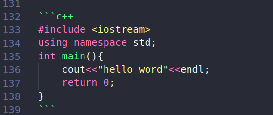
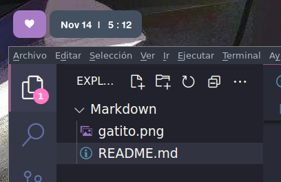
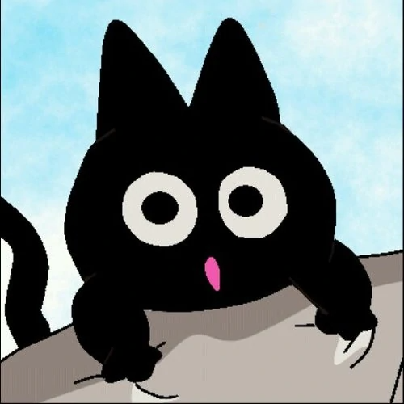

# Apuntes Markdown

## Indice
1. [Titulo y subtitulo](#id1)
2. [Letra](#id2)
3. [Listas](#id3)
4. [Enlaces](#id4)
5. [Colocar código](#id5)
6. [Tablas](#id6)
7. [Imágenes](#id7)
8. [Extra](#id8)


## Titulo y subtitulo<div id='id1' />


* Los TÍTULOS se hacen con este símbolo: #.

```
#Titulo
```

* Los SUBTÍTULOS se hacen con # pero así:
```
## hola
### hola
#### hola
##### hola
###### hola
```
<br>

---

<br>

## Letra<div id='id2' />

* Para hacer letra en cursiva: *hola* 

```
*hola*
```

* Para subrayar texto o palabra: hola

```
**hola**
```

* Para tachar algún texto o palabra: ~~hola~~

```
~~hola~~
```

<br>

---

<br>

## Listas<div id='id3' />


Hay listas ordenadas y desordenadas. Las listas ordenadas son las que van en orden (los números o letras) y las listas desordenadas son las que tienen asteriscos u otro símbolo.


* **Ordenadas**

1. Hola
2. Soy una lista
    1. Ordenada


* **Desordenadas**

* Hola
* Soy una lista
    * Desordenada
<br>

---

<br>

## Enlaces<div id='id4' />

```
[nombre del link](url)
```

 Ejemplo: [ábreme](https://www.youtube.com/watch?v=I0tZmujx5BM)

 <br>

Si cuando pasamos el cursor por el enlace queremos que muestre un mensaje colocamos:

```
[nombre del link](url "mensaje")
```

 Ejemplo: [ábreme](https://www.youtube.com/watch?v=I0tZmujx5BM "ábrelo -_-")


<br>

---

<br>

## Colocar código<div id='id5' />


* Para mostrar solo una línea de código, se pone solo una tilde así:

```
`console.log (hello word)
`
```

se vería así:

`
console.log (hello word)
`

<br>

* Para mostrar un párrafo o más de una línea de código, se pone triple tilde: 


se vería así:
```
#include <iostream>
using namespace std;
int main(){
    cout<<"hello word"<<endl;
    return 0;
}
```
<br>

* Si queremos darle color a la sintaxis, a las primeras tildes se le agrega el nombre del lenguaje así:



se vería así:

```c++
#include <iostream>
using namespace std;
int main(){
    cout<<"hello word"<<endl;
    return 0;
}
```
<br>

---

<br>

## Tablas<div id='id6' />

El símbolo que necesitamos es: | (está abajo de la tecla Esc y arriba de tab.)

así: 
```
|CELDA1 |CELDA2 |CELDA3 |
|-------|-------|-------|
|hola   |hello  |hallo  |
|goku   |gohan  |goten  |
```

se vería así:

|CELDA1 |CELDA2 |CELDA3 |
|-------|-------|-------|
|hola   |hello  |hallo  |
|goku   |gohan  |goten  |

<br>

---

<br>

## Imágenes<div id='id7' />

hay dos formas de hacerlo:

* Por URL:
```

```
en este modo debemos guardar o poner nuestra imagen en la carpeta donde tengamos el archivo .md de vsc asÍ:



<br>

### Ejemplo por URL:


para acortar el link usamos: [bitly](https://bitly.com/)

<br>

### Ejemplo de manera local:



<br>

> Acá igual podemos hacer que al pasar el cursor por la imagen se muestre un mensaje así:


<br>

---

<br>

## Extra<div id='id8' />

* Para crear citas usamos: >
```
> Asi se colocan las citas.
se vería así:
```
> Así se vería una cita.

<br>

* Para colocar separadores de texto es con: --- o ___

<br>

* Para colocar un comentario usamos: 

<!--comentario-->

<br>

* En github podemos:

    * Nombrar a alguien y le llegara notificacion: 
    `
    @nombrepersona
    `

    * Poner emojis: 
        * primero buscamos en internet: github emojis o en este [link](https://gist.github.com/rxaviers/7360908)
        *luego colocamos el emoji: :stuck_out_tongue:

    * para guardar cambios lo hacemos desde terminal o editamos desde githun el archivo.
